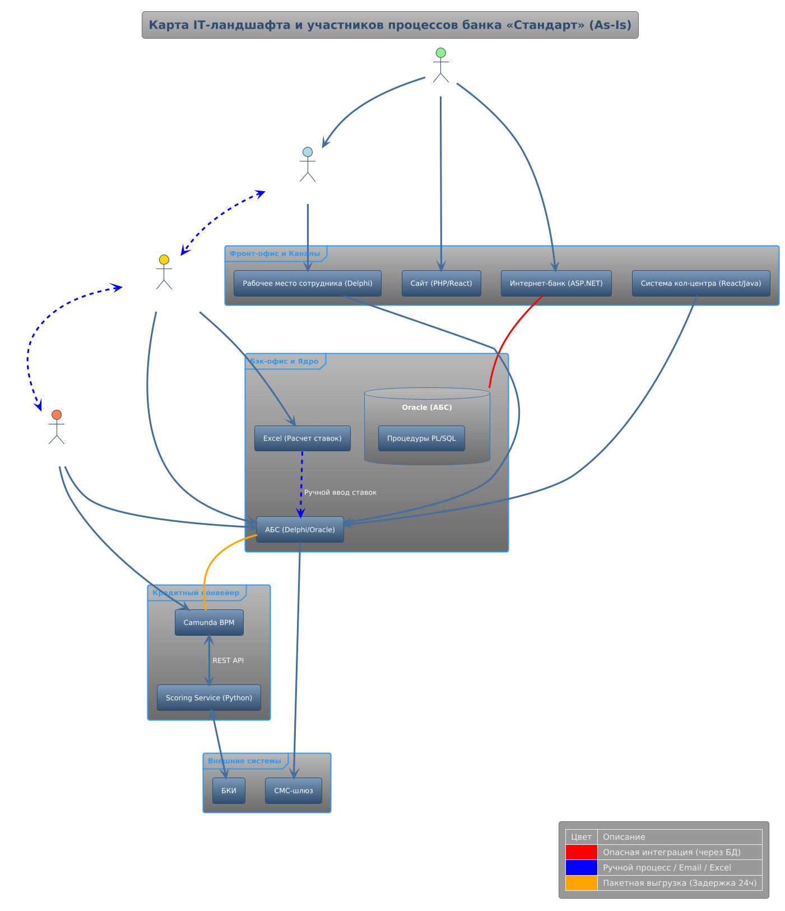

# Анализ IT-ландшафта и бизнес-процессов банка «Стандарт»

В данном документе представлена карта текущего IT-ландшафта и детальный анализ проблемных зон в ключевых бизнес-процессах (кредитование и депозиты).

---

## 1. Матрица IT-ландшафта

Анализ покрытия бизнес-возможностей информационными системами банка (состояние As-Is).

| Организационная структура / Бизнес-возможности | Продажи в сети отделений | Продажи через кол-центр | Digital-оповещения | Обслуживание депозитов | Обслуживание кредитов | Управление договорами |
| :--- | :--- | :--- | :--- | :--- | :--- | :--- |
| **Управление обслуживанием в сети (Фронт)** | АБС (Delphi) | — | — | — | АБС (заведение заявки) | АБС (печать и загрузка) |
| **Кол-центр (Банка и партнёрский)** | — | Система КЦ (React/Java) | — | — | — | Система КЦ (скрипты) |
| **Управление депозитами (Бэк)** | — | — | — | Excel, АБС, Email | — | АБС |
| **Управление кредитами (Бэк)** | — | — | — | — | Кредитный конвейер (Camunda), Scoring | АБС |
| **Управление IT** | — | — | СМС-шлюз | — | — | — |
| **Клиент (Самообслуживание)** | — | — | — | Интернет-банк (только платежи) | — | — |

---

## 2. Анализ кредитного процесса (Вывод по ландшафту)

На основе анализа систем интеграции выявлены критические архитектурные ограничения, влияющие на скорость обслуживания клиентов:

* **Высокая инерционность (Batch-интеграции):** Текущий процесс характеризуется задержками из-за передачи данных между системами раз в сутки. 
* **Задержки на этапе сбора данных:** Заявка, созданная в АБС, попадает в «Кредитный конвейер» (Camunda) только на следующий рабочий день.
* **Проблемы актуальности данных в скоринге:** Хотя система скоринга использует внешние данные БКИ онлайн, данные о внутренних платежах клиента из АБС приходят с задержкой в 24 часа через синхронизацию БД. Это создает риски при оценке надежности заемщика.
* **Задержка исполнения:** Информация об одобрении кредита возвращается из конвейера в АБС также только через сутки, после чего происходит фактическое зачисление средств.
* **Итоговый результат:** Из-за архитектурных ограничений интеграции «через БД» минимальный срок выдачи кредита составляет **от 2 до 3 рабочих дней**, что не соответствует современным ожиданиям рынка.

---

## 3. Анализ депозитного процесса

Процесс открытия депозитов является наиболее критическим с точки зрения цифровой трансформации из-за высокой доли ручного труда:

1. **Отсутствие системного расчета ставок:** Ставки рассчитываются вручную в Excel-файлах сотрудниками отдела кредитования и передаются в бэк-офис по электронной почте.
2. **Изоляция подразделений:** Сотрудники депозитного и кредитного отделов не имеют доступа к данным друг друга, что вынуждает их использовать Email для согласования условий, увеличивая время ожидания клиента в отделении до 1 часа.
3. **Технологический долг интернет-банка:** Текущая интеграция интернет-банка напрямую с базой данных АБС ограничивает возможности масштабирования и не позволяет внедрить автоматическое открытие счетов без участия бэк-офиса.

## 4. Схема интеграции приложений с указанием участников.

## 5. Резюме

Текущий ландшафт характеризуется «лоскутной» автоматизацией. Для перехода к целевому состоянию (открытие продуктов за минуты) необходимо:
1. Заменить пакетные (Batch) интеграции на событийные (через очереди сообщений или API).
2. Вынести логику расчета ставок из Excel в централизованный сервис (Rate Engine).
3. Перейти от прямого доступа к БД АБС к сервисному взаимодействию.