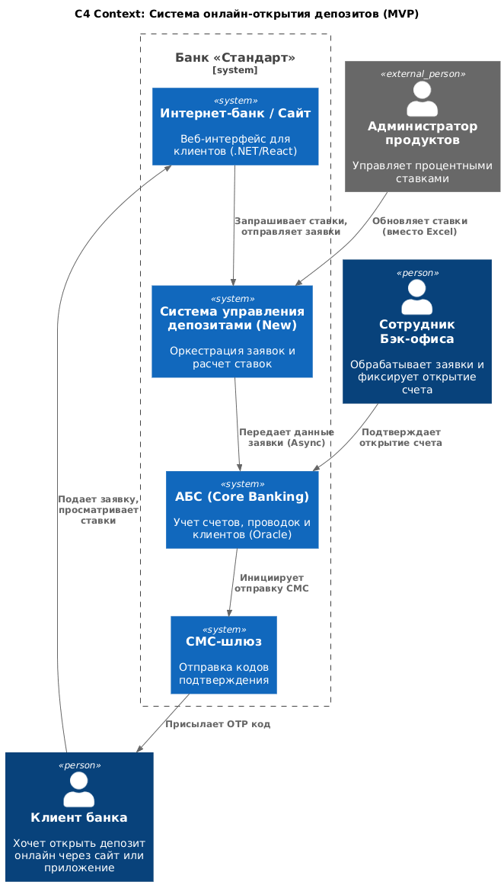
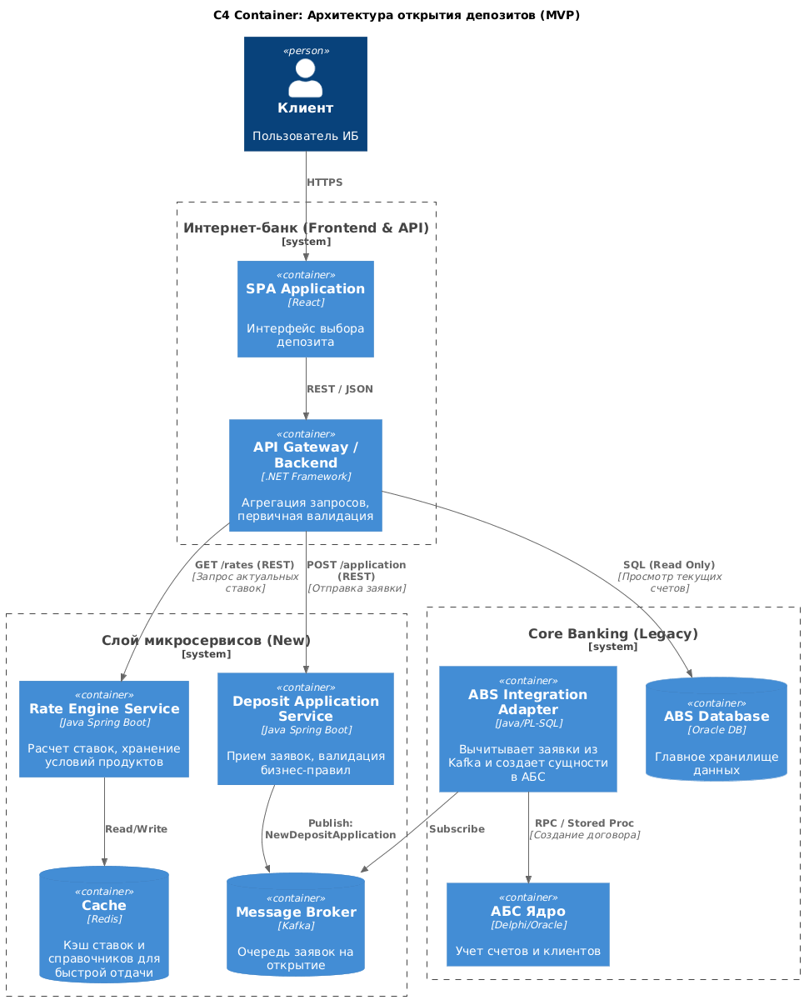

# Название: Внедрение архитектуры для онлайн-открытия депозитов (MVP)

**Статус:** Предложено

**Контекст:**
Банк «Стандарт» стремится привлечь новых клиентов через цифровые каналы. Текущий процесс открытия депозитов требует посещения офиса, ручного расчета ставок в Excel и пересылки данных по email, что делает невозможным мгновенное обслуживание.

Существующие ограничения:
1. Интернет-банк (монолит ASP.NET) интегрирован напрямую с БД АБС (Oracle), которая перегружена.
2. Отсутствует централизованная система управления ставками (ставки в Excel).
3. Процессы бэк-офиса не автоматизированы для онлайна.
4. Требование бизнеса: MVP должно быть реализовано быстро, с использованием текущего стека (Java, .NET, SQL), но с заделом на микросервисы.

**Решение:**
Мы предлагаем внедрить **гибридную архитектуру** с выделением новых микросервисов для критических функций, сохраняя АБС как мастер-систему для учета.

Ключевые архитектурные решения:
1. **Rate Engine (Сервис ставок):** Выделение логики расчета ставок из Excel в отдельный микросервис (Java/Spring Boot). Это обеспечит единый источник правды для сайта, ИБ и отделений.
2. **Deposit Application Service:** Создание сервиса оркестрации заявок для приема данных с сайта и ИБ, их валидации и асинхронной передачи в бэк-офис.
3. **Очереди сообщений (Kafka):** Использование Kafka для развязки Интернет-банка и АБС. Заявки не пишутся напрямую в БД АБС, а попадают в топик, откуда их вычитывает адаптер АБС.
4. **Кэширование (Redis):** Внедрение кэша для справочников и ставок на стороне фронтальных систем для обеспечения отклика <100мс и снижения нагрузки на АБС.

**Сценарии использования (Use Cases):**
1. **Клиент (новый)** на сайте выбирает депозит, видит актуальную ставку (запрос в Rate Engine), оставляет заявку (ФИО, телефон).
2. **Клиент (существующий)** в Интернет-банке видит персонализированное предложение, подтверждает открытие СМС-кодом.
3. **Операционист** в АБС получает задачу на открытие счета (для MVP заявка падает в очередь на ручную обработку или полуавтоматическое создание).
4. **Администратор** загружает новые базовые ставки в Rate Engine вместо рассылки Excel-файлов.

**Последствия:**
* (+) **Скорость:** Устранение "узкого горлышка" в виде ручного расчета ставок.
* (+) **Надежность:** Снижение нагрузки на БД АБС за счет кэширования и асинхронности.
* (+) **Безопасность:** Исключение прямого доступа из веба в ядро банка.
* (-) **Сложность:** Появление новых компонентов (Kafka, Redis, Microservices), требующих поддержки.
* (-) **MVP ограничение:** В первой версии (MVP) сохраняется этап ручной финализации открытия счета сотрудником бэк-офиса, полная автоматизация — следующий этап.

---
**Диаграммы:**
Это:

И это:
