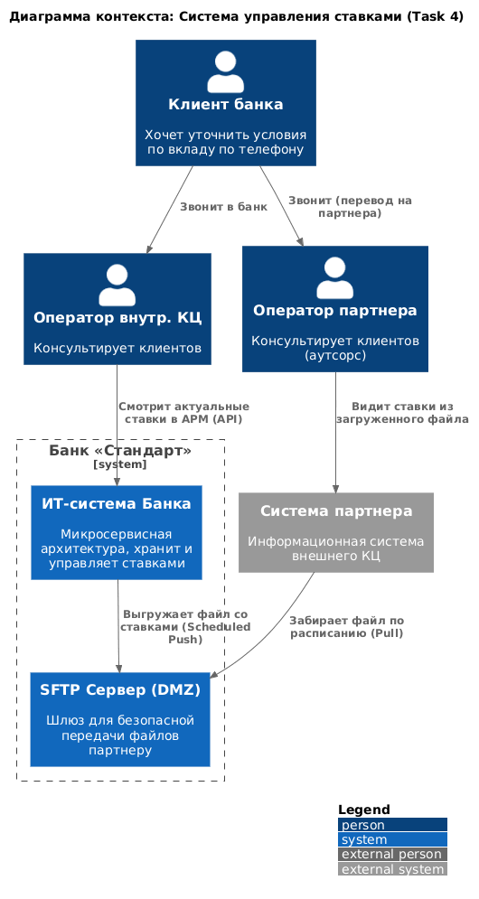
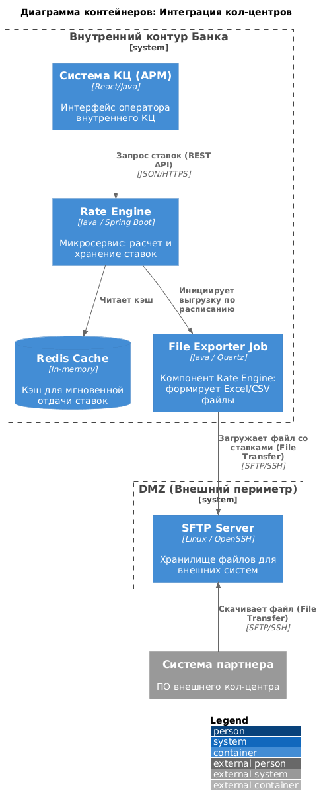
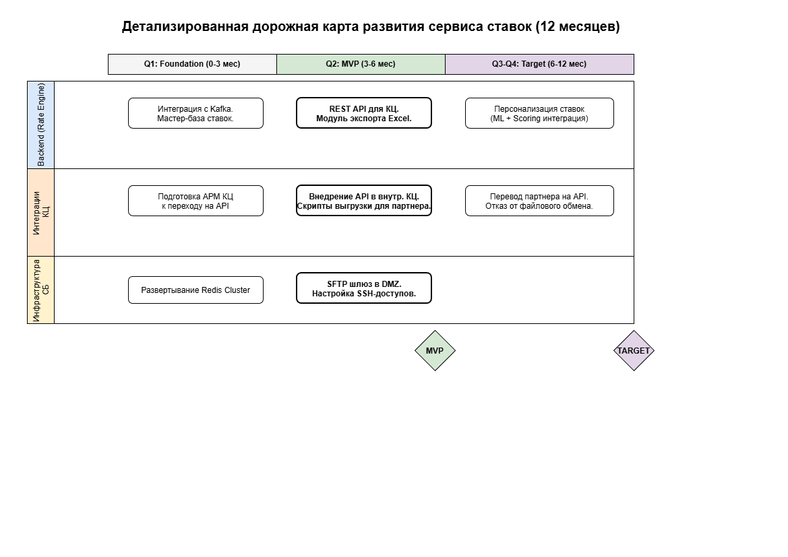

### **Название задачи:** Интеграция внутреннего и партнерского колл-центров с сервисом актуальных ставок
### **Автор:** MAR
### **Дата:** 15.02.2026

### **Функциональные требования**
Необходимо обеспечить сотрудников внутреннего и партнерского КЦ актуальными данными по ставкам депозитов, исключив ручной поиск в разрозненных файлах.

|**№**|**Действующие лица или системы**|**Use Case**|**Описание**|
| :-: | :- | :- | :- |
| 1 | Оператор внутреннего КЦ | **Просмотр ставок онлайн** | Оператор через интерфейс АРМ обращается к Rate Engine. Система возвращает актуальные ставки в режиме реального времени (из Redis кэша). |
| 2 | Система Rate Engine | **Формирование файлов (Export)** | По расписанию сервис агрегирует данные из БД и формирует файл в формате Excel (.xlsx) или CSV. |
| 3 | Система Rate Engine | **Передача файла на SFTP (Push)** | Сформированный файл автоматически передается на SFTP-сервер в DMZ-зоне. Это заменяет API-вызовы для внешнего партнера. |
| 4 | Партнерский КЦ (Система) | **Обновление справочников** | Внешняя система скачивает файл с SFTP и обновляет локальные данные для своих операторов. |

### **Нефункциональные требования**
|**№**|**Требование**|**Описание / Значение**|
| :-: | :- | :- |
| 1 | **Способ интеграции** | Для партнера используется файловый обмен (SFTP). Прямые API-вызовы исключены из-за ограничений на стороне партнера. |
| 2 | **Безопасность** | Изоляция через DMZ-зону. Доступ партнера по SSH-ключу и только к выделенной директории. |
| 3 | **Производительность** | Время отклика API для внутреннего КЦ — не более 200 мс (95-й перцентиль). |
| 4 | **Актуальность** | Данные у внешнего партнера должны обновляться не реже 1 раза в сутки. |

### **Решение**
Внедряется гибридная схема дистрибуции данных на базе микросервиса **Rate Engine**. Внутренний контур работает через синхронный REST API, а внешний партнер получает данные через асинхронный паттерн **File Transfer**. 

**Логика выбора:** Так как у партнера "нет возможности сделать API-вызовы (например, через SFTP)", банк выступает инициатором (Push-модель). Мы сами выгружаем данные на SFTP-шлюз, что технически не является API-вызовом со стороны партнера и полностью соответствует его ограничениям.

**Диаграмма контекста (C4 Context):**

**Диаграмма контейнеров (C4 Container):**

---

### **Детализированный Roadmap (MVP + Target)**

Развитие сервиса разбито на три фазы для обеспечения стабильности и преемственности с предыдущими задачами.

#### **Фаза 1: Data & Core (Месяцы 1-3)**
* **Backend:** Стабилизация мастер-базы ставок в Rate Engine, интеграция с Kafka для получения изменений из АБС.
* **Infrastructure:** Развертывание Redis для кэширования ответов API и обеспечения производительности.
* **Результат:** Сформировано отказоустойчивое ядро системы.

#### **Фаза 2: MVP & Channels (Месяцы 3-6) — ТЕКУЩИЙ ЭТАП**
* **Backend:** Разработка REST-эндпоинтов для АРМ и модуля генерации .xlsx/.csv файлов.
* **Infrastructure:** Развертывание SFTP-сервера в DMZ, настройка SSH-доступов и Firewall для партнера.
* **Channels:** Доработка интерфейса внутреннего КЦ (подключение к API).
* **Результат:** Запуск автоматизированного обмена. Релиз MVP.

#### **Фаза 3: Target State (Месяцы 6-12)**
* **Backend:** Реализация логики персонализированных ставок на основе профиля клиента (ML/Scoring).
* **Integration:** Публикация внешнего API через API Gateway для партнеров.
* **Channels:** Постепенный отказ от SFTP и переход партнера на API-взаимодействие.
* **Результат:** Целевая цифровая архитектура без файловых зависимостей.

---

### **Альтернативы**
1. **Прямое подключение партнера к БД:** Категорически отвергнуто из-за критических рисков безопасности и нарушения контуров сети.
2. **Разработка API на стороне партнера:** Отвергнуто, так как партнер официально подтвердил отсутствие технической возможности принимать API-вызовы.
3. **Ручная пересылка Excel по почте:** Отвергнуто как небезопасный процесс, подверженный человеческому фактору и ошибкам.

**Недостатки, ограничения, риски**
* **Разница в технологиях:** Необходимость поддерживать два механизма (API и файловый экспорт), что усложняет тестирование.
* **Риск задержки (Stale Data):** При изменении ставок внутри дня партнер узнает об этом только после следующей итерации выгрузки (задержка до 24ч).
* **Человеческий фактор на стороне партнера:** Мы не контролируем корректность и скорость обработки загруженного файла в системе партнера.