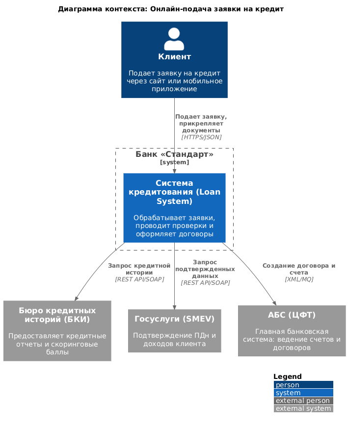
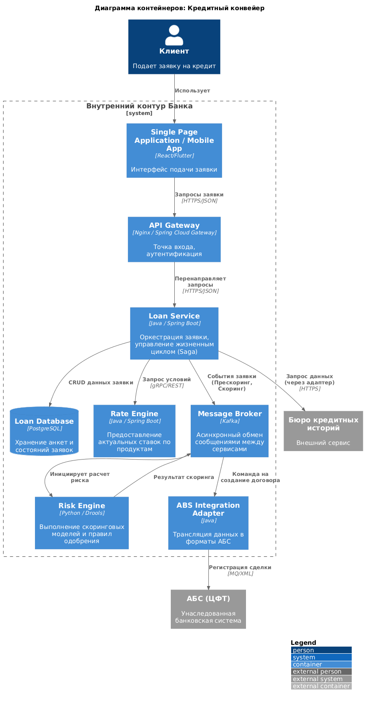
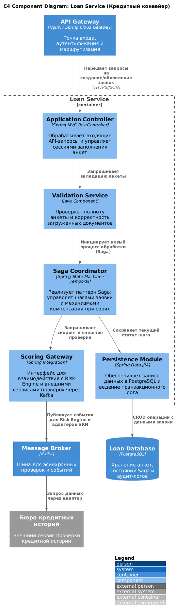

### **Название задачи:** Внедрение процесса онлайн-подачи заявок на кредитные продукты
### **Автор:** MAR
### **Дата:** 15.02.2026

### **Функциональные требования**
Детализированные Use Cases для реализации кредитного конвейера в течение года после MVP:

|**№**|**Действующие лица**|**Use Case**|**Пошаговое описание (сценарий)**|
| :-: | :- | :- | :- |
| 1 | Клиент | **Подача кредитной заявки онлайн** | 1. Клиент авторизуется в системе через мобильное приложение или сайт. 2. Клиент выбирает кредитный продукт и заполняет анкетные данные. 3. Клиент загружает необходимые документы (скан паспорта, справка о доходах). 4. Система сохраняет черновик и отправляет заявку на первичную обработку. |
| 2 | Loan Service | **Первичная валидация и прескоринг** | 1. Система проверяет корректность заполнения полей и наличие документов. 2. Выполняется автоматическая проверка клиента по внутренним стоп-листам банка. 3. Инициируется асинхронный запрос в БКИ через шину Kafka. 4. При получении положительных результатов статус заявки меняется на «Готов к скорингу». |
| 3 | Risk Engine | **Принятие решения по кредиту** | 1. Компонент получает агрегированные данные по клиенту из Loan Service. 2. Применяется математическая скоринговая модель для оценки платежеспособности. 3. Формируется решение (Одобрено/Отказ) с указанием лимита и процентной ставки. 4. Результат передается обратно в Loan Service для дальнейшей обработки. |
| 4 | АБС (ЦФТ) | **Оформление кредитного договора** | 1. Система получает команду на создание договора после одобрения заявки. 2. Автоматически открывается ссудный счет в балансе банка. 3. Генерируется электронная форма договора и график платежей. 4. Клиент получает уведомление о возможности подписания документов в ЛК. |

### **Нефункциональные требования**
Требования структурированы согласно модели **FURPS+**:

|**№**|**Категория**|**Требование**|
| :-: | :- | :- |
| 1 | **Functionality** | Интеграция с внешними источниками (БКИ, Госуслуги) и внутренней шиной Kafka для обмена данными. |
| 2 | **Usability** | Возможность сохранения черновика заявки и возобновления заполнения на любом устройстве. |
| 3 | **Reliability** | Гарантированная доставка заявок в АБС с использованием паттерна Saga для обеспечения транзакционной целостности. |
| 4 | **Performance** | Время предварительного одобрения заявки (прескоринг) не должно превышать 30 секунд. |
| 5 | **Supportability** | Вынос бизнес-правил скоринга в отдельный движок (Risk Engine) для оперативного изменения параметров риска без пересборки кода. |
| 6 | **+ (Security)** | Строгое соответствие ФЗ-152: шифрование персональных данных при хранении и передаче (TLS 1.3, AES-256). |

### **Решение**

**Логика решения:**
Центральным компонентом системы является **Loan Service**, выполняющий роль оркестратора процесса. Для минимизации связанности систем и обеспечения отказоустойчивости выбран событийно-ориентированный подход на базе **Kafka**. Процесс обработки заявки реализуется через распределенную транзакцию (паттерн **Saga**), что позволяет гарантировать консистентность данных между микросервисами и АБС.

**Диаграмма контекста (C4 Context):**

На диаграмме отображается взаимодействие клиента с фронт-офисными системами банка, интеграция с внешними бюро (БКИ) и передача данных в учетную систему (АБС).

**Диаграмма контейнеров (C4 Container):**

Детализация решения включает:
1. **Loan Service API** — оркестрация жизненного цикла заявки.
2. **Risk Engine** — компонент для выполнения скоринговых моделей.
3. **Kafka** — транспорт для асинхронных проверок и событий.
4. **Integration Adapters** — прослойка для работы с внешними API и унаследованной АБС.

**Диаграмма компонентов Loan Service (C4 Component):**

Внутренняя структура Loan Service включает следующие ключевые компоненты:
* **Application Controller**: Обработка входящих API-запросов и управление сессиями заполнения анкет.
* **Saga Coordinator**: Реализация логики последовательности шагов и механизмов компенсации при сбоях.
* **Scoring Gateway**: Интерфейс взаимодействия с Risk Engine и внешними сервисами проверок.
* **Persistence Module**: Обеспечение записи данных в PostgreSQL и ведение аудит-лога изменений.

### **Альтернативы**
1. **Реализация логики на стороне АБС (ЦФТ):** Отвергнуто. АБС имеет низкий TTM (Time-to-Market) и не предназначена для обработки большого объема невалидных «сырых» заявок с фронт-офиса.
2. **Использование внешней облачной платформы:** Отвергнуто из-за высоких рисков безопасности и сложности выполнения требований по локализации ПДн внутри контура банка.

**Недостатки, ограничения, риски**

* **Риск зависимости от внешних API**: Задержки в ответах от БКИ/Госуслуг могут замедлить процесс. Решение: использование кэширования результатов и асинхронных очередей.
* **Сложность распределенной отладки**: Процесс Saga требует внедрения инструментов сквозной трассировки (Jaeger/OpenTelemetry).
* **Масштабируемость АБС**: Ограничение пропускной способности АБС при создании договоров. Решение: демпфирование нагрузки через очереди сообщений.